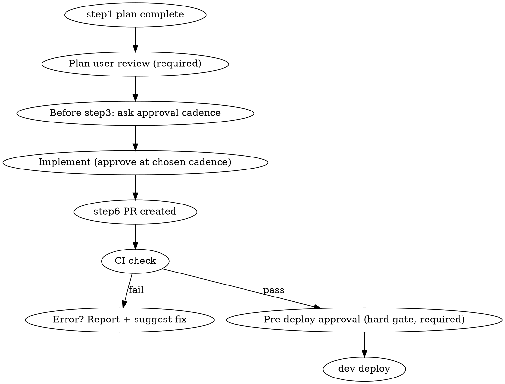

# dev-pipeline (orchestrator)

This skill is **run directly by the main agent**. Each step is delegated by **spawning a sub-agent via the `Agent` tool**. Sub-agents return only summaries, keeping the main context lightweight. All communication and approvals with the user are **handled by the main agent**.

> 한글: 이 스킬은 **메인 에이전트가 직접 실행**한다. 각 단계는 **`Agent` 도구로 서브에이전트를 띄워** 위임한다. 서브는 요약만 반환하므로 메인 컨텍스트는 가볍게 유지된다. 유저와의 모든 소통·승인은 **메인이 담당**한다.

## Core Principles

- **Sequential pipeline.** The output of each step is the input of the next. No parallelism (branching is allowed only within a single step, e.g., multi-axis review).
- **Hand-off via files.** Sub-agents do not share memory. Data between steps is passed only through state files, `plan.md`, and `todo.md`.
- **Stop when blocked.** At any step, if the sub-agent reports ambiguity or a conflict, or if a question arises, do not guess — **ask the user**.

> 한글:
> - **순차 파이프라인.** 앞 단계 산출물이 다음 단계 입력. 병렬 아님(한 단계 안에서만 갈래 가능, 예: 다축 리뷰).
> - **파일로 핸드오프.** 서브에이전트는 메모리를 공유하지 않는다. 단계 간 데이터는 상태 파일·`plan.md`·`todo.md`로만 넘긴다.
> - **막히면 멈춘다.** 어느 단계든 서브가 모호함·충돌을 보고하거나 의문이 생기면, 추측하지 말고 **유저에게 질문**한다.

## State File (Step-to-Step Hand-off)

Run directory: `~/.claude/dev-pipeline/runs/<REPO>-<ISSUE>/`
- `state.md` — format below. The main agent updates this after every step.
- `plan.md`, `todo.md` — outputs of step 1 (canonical copies live in the run directory; may also be copied into the worktree).

> 한글:
> 런 디렉토리: `~/.claude/dev-pipeline/runs/<REPO>-<ISSUE>/`
> - `state.md` — 아래 형식. 매 단계 후 메인이 갱신.
> - `plan.md`, `todo.md` — step 1 산출물(정본은 런 디렉토리, 워크트리에도 복사 가능).

```markdown
# dev-pipeline state — <ISSUE>
- repo: <repo>
- issue: <ISSUE>            # 예: CSD-7751
- issue_url: <url>
- branch: feat/<ISSUE>-<slug>
- worktree: <path>
- approval_cadence: per-step | after-implement | after-pr   # step3 전 유저가 선택
- pr_url:
- status: { context, prepare, implement, review, test, ship, archive } = pending|in-progress|done
- decisions:
  - <단계에서 내린 비자명 결정 한 줄씩>
- feature: <slug>
- cycle_type: dev | feedback | bugfix
- cycle_seq: <n>
- spec_path: features/<slug>/spec.md
- adr_paths: []
```

## Step ↔ Sub-agent Mapping

| # | Step | Model | Skill to Follow | Notes |
|---|------|-------|-----------------|-------|
| 1 | Context gathering + plan | **opus** | `dp-context` | Outputs `plan.md` + `todo.md`; 타입별 spec 분기 |
| 2 | Prepare (worktree/branch) | sonnet | `dp-prepare` | Branches after repo detection |
| 3 | Implement | opus or sonnet | `dp-implement` | opus for complex work, sonnet by default; 비자명 결정 시 ADR 작성 |
| 4 | Code review | sonnet | `dp-review` | spec 수용기준 대조 + ADR 결정 추적 |
| 5 | Test | sonnet | `dp-test` | |
| 6 | PR + deploy | sonnet | `dp-ship` | PR → CI → **pre-deploy approval** → deploy |
| 7 | Archive | sonnet | `dp-archive` | Delete worktree + write permanent record; cycles/ + feature.md/spec.md/index.md 갱신 |

> 한글: 각 단계는 위 표의 모델과 스킬에 따라 서브에이전트로 위임한다. step 3은 작업 복잡도에 따라 opus/sonnet을 선택한다.

Sub-agent call form (example):

```
Agent(
  subagent_type: "general-purpose",
  model: "sonnet",            # 표 기준
  description: "...",
  prompt: "Follow the dp-prepare skill. 입력: repo=..., issue=..., state 파일=<경로>.
           완료하면 한 일 요약 + 갱신한 state 값(branch, worktree)만 반환."
)
```

When the sub-agent finishes, **the main agent reads the returned summary, updates `state.md`**, and proceeds to the next step.

> 한글: 서브가 끝나면 **메인이 반환 요약을 보고 `state.md`를 갱신**하고 다음 단계로 간다.

## Approval Gates (Must Be Followed)



1. **Plan review (required):** After step 1, show `plan.md` to the user. Do not proceed to step 2 until the user approves.
2. **Approval cadence question (before step 3):** Ask the user — for this task, should approvals happen (a) per plan step, (b) once after the full implementation, or (c) after PR creation? Record the answer in `state.md` as `approval_cadence` and follow it exactly.
3. **CI check (step 6, immediately after PR creation):** If git CI fails, stop and **report the error + suggest a fix**. Proceed only after the user decides.
4. **Pre-deploy approval (hard gate, never skip):** After PR creation and CI pass, the user's approval **must** be obtained immediately before the dev deploy.
5. **At any time:** Uncertainty, conflict, or ambiguity → stop and ask.

> 한글:
> 1. **플랜 검토(필수):** step 1 후 `plan.md`를 유저에게 보여주고 승인받기 전엔 step 2로 안 간다.
> 2. **승인 주기 질문(step 3 전):** 유저에게 묻는다 — 이 작업은 (a) 플랜 단계별 승인 / (b) 구현 전체 후 1회 승인 / (c) PR 생성 후 승인 중 무엇? 답을 `state.md`의 `approval_cadence`에 기록하고 그대로 따른다.
> 3. **CI 확인(step 6, PR 생성 직후):** git CI가 실패면 멈추고 **에러 보고 + 수정 제안**. 유저 결정 후 진행.
> 4. **배포 전 승인(하드 게이트, 절대 생략 금지):** PR 생성·CI 통과 후, dev 배포 **직전** 반드시 유저 승인을 받는다.
> 5. **언제든:** 의문·충돌·모호함 → 멈추고 질문.

## What the Main Agent Does at Start

1. Identify the issue: extract the issue number and repo from the Jira text/URL/`CSD-XXXX` the user provided. Ask if unclear.
1.5. **Cycle router:** Before the main stages, determine two things.
   - **Feature key:** Look up the CSD→slug mapping in `features/index.md`. If new, ask the user for a slug, create `features/<slug>/` (with `feature.md` based on `templates/feature.md`). If existing, load it.
   - **Type:** Determine dev/feedback/bugfix from the issue content. Ask the user if unclear.
   - Record results in state: `feature`, `cycle_type`, `cycle_seq`, `spec_path`. `cycle_seq` = the next number inside `cycles/` for that feature.
2. Create the run directory and initialize `state.md`.
3. Delegate to sub-agents step by step per the table → respect gates → update state, and repeat.
4. After step 7, notify the user of the permanent archive path.

> 한글:
> 1. 이슈 식별: 유저가 준 Jira 텍스트/URL/`CSD-XXXX`에서 이슈번호·repo 파악. 불명확하면 질문.
> 1.5. **사이클 라우터:** 본격 단계 전 두 가지를 정한다.
>    - **기능 키:** `features/index.md`에서 CSD→slug 매핑 조회. 신규면 유저에게 slug를 묻고 `features/<slug>/`(+ templates/feature.md 기반 feature.md) 생성, 기존이면 로드.
>    - **타입:** 이슈 내용으로 dev/feedback/bugfix 판정. 불명확하면 유저에게 질문.
>    - 결과를 state의 feature/cycle_type/cycle_seq/spec_path에 기록. cycle_seq = 해당 기능 cycles/ 내 다음 번호.
> 2. 런 디렉토리 생성, `state.md` 초기화.
> 3. step 1부터 표대로 서브에이전트 위임 → 게이트 준수 → state 갱신 반복.
> 4. step 7 후 영구 아카이브 경로를 유저에게 알림.

## Notes

- Use the model specified in the table; for step 3, choose opus or sonnet based on task complexity (ask the user if uncertain).
- Steps that wrap existing skills (2, 4, 5, 6) must follow that skill's rules and conventions exactly (branch prefix `feat/CSD-XXXX-`, PR base `main`, etc.).

> 한글:
> - 모델은 표 기준이되 step 3은 작업 복잡도로 opus/sonnet 선택(불확실하면 유저에게).
> - 기존 스킬을 감싸는 단계(2·4·5·6)는 그 스킬의 규칙·컨벤션을 그대로 따른다(브랜치 `feat/CSD-XXXX-`, PR base `main` 등).
